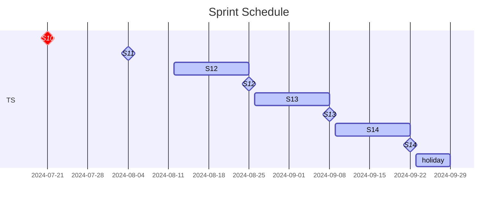
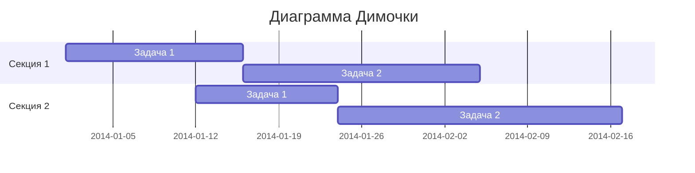

# sofia-repo

> [!NOTE]
> о том как запихнуть медведя в теремок

- [ ] сплести браслетик с++

## Софочка Actual

## All

```mermaid
gantt
    title Sprint Schedule
    dateFormat  YYYY-MM-DD
    section TS
    S10: crit, milestone, s10_end, 2024-07-21, 0d
    S11: active, milestone, s11_end, 2024-08-04, 0d
    S12: active, 2024-08-12, 2024-08-25
    S12: active, milestone, s12_end, 2024-08-25, 0d
    S13: active, 2024-08-26, 2024-09-08
    S13: active, milestone, s13_end, 2024-09-08, 0d
    S14: active, 2024-09-09, 2024-09-22
    S14: active, milestone, s14_end, 2024-09-22, 0d
    holiday: active, 2024-09-23, 2024-09-29
```

```mermaid
gantt
    title Диаграмма Димочки
    dateFormat  YYYY-MM-DD
    section Секция 1
    Задача 1         :a1, 2014-01-01, 15d
    Задача 2         :20d
    section Секция 2
    Задача 1         :2014-01-12  , 12d
    Задача 2         : 24d
```
